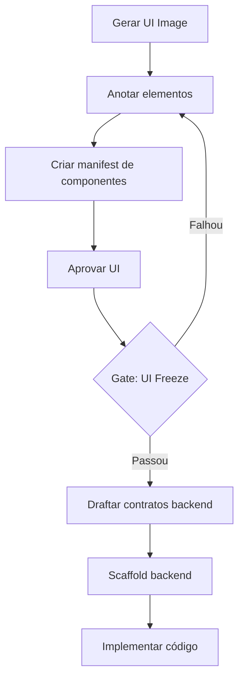

# Imagefront Framework

**AI-Assisted UI-First Software Development Framework**

Imagefront é um framework de desenvolvimento de software assistido por IA que suporta **iterações UI-first**, permitindo que equipes gerem e aprovem protótipos de UI antes de implementar qualquer backend.

## 🎯 O que é este repositório?

Este repositório contém a **especificação completa do framework Imagefront**, incluindo:

- 📋 **JSON Schemas** para validação de artefatos
- 📝 **Templates** prontos para uso
- 🤖 **Prompts estruturados** para agentes LLM (Claude Code, ChatGPT, etc.)
- 📚 **Guias** de workflow e best practices
- 💡 **Exemplos práticos** de cada tipo de artefato

**Este não é um projeto de software implementado.** São especificações e documentação que você pode baixar e adaptar para seu próprio projeto.

## 🚀 Quick Start

### Install with One Command

**Linux/macOS (Bash):**
```bash
# Install in current directory (default: React + shadcn/ui)
curl -fsSL https://raw.githubusercontent.com/alexlopespereira/imagefront/main/install.sh | bash
```

**Windows (PowerShell):**
```powershell
# Install in current directory (default: React + shadcn/ui)
iwr -useb https://raw.githubusercontent.com/alexlopespereira/imagefront/main/install.ps1 | iex
```

### Customize Installation

**Bash (Linux/macOS/Git Bash):**
```bash
# Download and run with options
curl -fsSL https://raw.githubusercontent.com/alexlopespereira/imagefront/main/install.sh -o install.sh
chmod +x install.sh

# With Vue + Material Design
./install.sh --framework vue --style material

# With .NET backend
./install.sh --framework react --backend dotnet

# In a specific directory
./install.sh --dir my-app --framework react
```

**PowerShell (Windows):**
```powershell
# Download script
iwr https://raw.githubusercontent.com/alexlopespereira/imagefront/main/install.ps1 -OutFile install.ps1

# With Vue + Material Design
.\install.ps1 -Framework vue -Style material

# With .NET backend
.\install.ps1 -Framework react -Backend dotnet

# In a specific directory
.\install.ps1 -TargetDir my-app -Framework react
```

📖 See **[INSTALLATION.md](INSTALLATION.md)** for complete installation guide.

### Post-Installation Setup

After installing the framework:

```bash
# 1. Install Python dependencies
pip install -r requirements.txt

# 2. Configure API keys
cp .env.template .env
# Edit .env and add your GOOGLE_API_KEY
# Get key at: https://aistudio.google.com/apikey

# 3. Generate your first UI
python .imagefront/scripts/generate-ui-image.py login-screen "A modern login screen"
```

### Use with Claude Code

After setup, ask Claude Code to help:

```
You: "Run generate-ui-image.py to create a dashboard screen"

Claude: ✅ UI screen generated!
        → ui_specs/dashboard/versions/2026-01-10-v1.png

You: "Annotate all elements in this screen"

Claude: ✅ Annotations created!
        → 12 elements identified
        → API calls: GET /api/stats, GET /api/users

You: "Create component manifest using React"

Claude: ✅ Manifest created!
        → Dashboard component defined
        → Props, state, events specified
```

## 📖 Documentação Principal

- **[FRAMEWORK_SPEC.md](FRAMEWORK_SPEC.md)** - Especificação completa do framework
- **[AGENTS.md](AGENTS.md)** - Guia de integração com agentes AI
- **[UI_ONLY_ITERATIONS.md](UI_ONLY_ITERATIONS.md)** - Especificação de iterações UI-only
- **[guides/getting-started.md](guides/getting-started.md)** - Tutorial passo a passo
- **[guides/workflow-guide.md](guides/workflow-guide.md)** - Workflow end-to-end
- **[guides/ai-integration.md](guides/ai-integration.md)** - Como usar com Claude Code

## 🎨 Workflow UI-First



## 📦 Estrutura de Artefatos

| Artefato | Schema | Template | Exemplo |
|----------|--------|----------|---------|
| UI Image | - | - | [examples/](examples/) |
| Annotations | [schemas/annotation.schema.json](schemas/annotation.schema.json) | [prompts/annotate-ui.md](prompts/annotate-ui.md) | [examples/example-annotation.json](examples/example-annotation.json) |
| Component Manifest | [schemas/component-manifest.schema.json](schemas/component-manifest.schema.json) | [prompts/create-component-manifest.md](prompts/create-component-manifest.md) | [examples/example-manifest.json](examples/example-manifest.json) |
| Approval | [schemas/approval.schema.json](schemas/approval.schema.json) | [templates/approval-template.json](templates/approval-template.json) | [examples/example-approval.json](examples/example-approval.json) |
| Contracts | [schemas/contract.schema.json](schemas/contract.schema.json) | [templates/contracts-template.md](templates/contracts-template.md) | [examples/example-contracts.md](examples/example-contracts.md) |
| Golden Trace | [schemas/trace.schema.json](schemas/trace.schema.json) | [prompts/generate-ux-sequence.md](prompts/generate-ux-sequence.md) | [examples/example-trace.yml](examples/example-trace.yml) |
| Assertions | [schemas/assertion.schema.json](schemas/assertion.schema.json) | - | [examples/example-assertions.yml](examples/example-assertions.yml) |

## ✨ Principais Conceitos

### UI-Only Iterations
Fase de desenvolvimento focada **apenas em UI/UX**, sem implementar backend real. Permite:
- Convergir rapidamente em requisitos e design
- Aprovar UX antes do custo de desenvolvimento
- Manter rastreabilidade completa

### UI Freeze Gate
Gate de qualidade que garante que UI está completa e aprovada antes de iniciar backend:
- ✅ Todas as telas têm imagens + anotações + manifestos
- ✅ Aprovações registradas com evidências
- ✅ Contratos de API drafted
- ✅ Nenhum artefato faltante

### Rastreabilidade
Cada artefato é versionado e linkado:
- Annotations → Component Manifests → Backend Contracts
- Approvals → Evidence (annotation IDs)
- UX Sequences → Golden Traces → Assertions

## 🛠️ Ferramentas Recomendadas

Este framework é **independente de tecnologia**. Você pode implementar ferramentas usando:

- **CLI:** Node.js (Commander.js), Python (Click), .NET (System.CommandLine)
- **Validação:** AJV, jsonschema (Python), NJsonSchema (.NET)
- **IA:** Google (Imagen/Nano Banana), Claude (Vision), Replicate (Flux, Stable Diffusion)

Ver [reference-implementations/](reference-implementations/) para exemplos.

## 📝 Convenções

- **Screen IDs:** `kebab-case` (ex: `login-screen`)
- **Versions:** `v1`, `v2`, `v3`...
- **Files:** `YYYY-MM-DD-vN.{png|json|md|yml}`
- **Requirement IDs:** `REQ-NNN` ou `REQ-NNN-description`

## 🤝 Contribuindo

Este é um framework de especificação aberto. Contribuições são bem-vindas:

1. Fork este repositório
2. Crie uma branch (`git checkout -b feature/nova-spec`)
3. Commit suas mudanças (`git commit -m 'Add nova especificação'`)
4. Push (`git push origin feature/nova-spec`)
5. Abra um Pull Request

## 📄 Licença

MIT License - veja [LICENSE](LICENSE) para detalhes.

## 🔗 Links Úteis

- [Documentação Completa](docs/)
- [Exemplos](examples/)
- [Schemas JSON](schemas/)
- [Templates](templates/)
- [Prompts para IA](prompts/)

---

**Nota:** Este framework menciona shadcn/ui apenas como referência de estilo visual para geração de imagens por IA. Não há dependência técnica de nenhuma biblioteca específica.